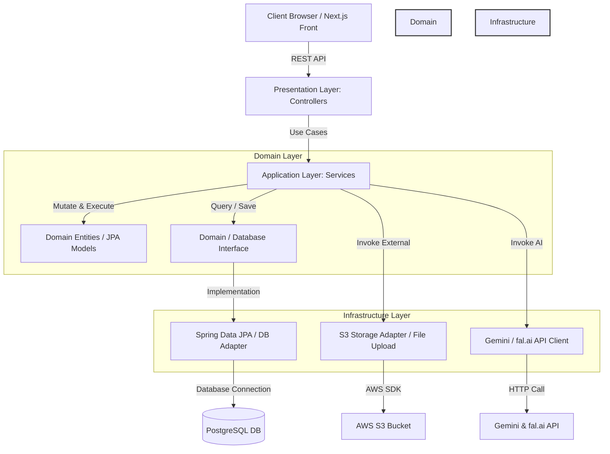

# a1-back 백엔드 아키텍처 분석 및 계층형 DDD 변경 제안 가이드

이 문서는 `a1-back` 프로젝트의 백엔드 패키지 트리와 소스 파일들을 기반으로 구조 및 사용 용도를 추측/분석하고, 이를 **DDD(도메인 주도 설계) 및 계층형(Layered) 하이브리드 아키텍처**로 체계화하기 위한 인프라 변경 및 구조 개선 방향을 제시합니다.

---

## 1. 현재 `src` 디렉토리 파일 구조 및 사용 용도 분석

현재 백엔드 서비스는 일부 도메인에서 **헥사고날 아키텍처(Ports & Adapters)**와 **도메인 격리 패턴**을 부분적으로 도입하고 있습니다.

### 도메인별 분석
1. **`generation` (이미지 생성 및 프롬프트 관리)**
   - `domain/model/GenerationJob.java`: 생성 요청에 대한 메타데이터, 사용 모델, 상태(`started`, `completed`, `failed`), 프롬프트, JSON 페이로드 입출력을 담는 핵심 JPA 엔티티이자 도메인 객체입니다.
   - `domain/repository/GenerationJobRepository.java`: 인프라 세부 기술과 디커플링하기 위한 도메인 레포지토리 인터페이스입니다.
   - `infrastructure/persistence/SpringDataGenerationJobRepository.java`: 실제 데이터베이스 처리를 담당하는 Spring Data JPA 인터페이스입니다.
   - `infrastructure/persistence/GenerationJobRepositoryAdapter.java`: 도메인 레포지토리의 상세 구현체(어댑터)로, Spring Data JPA 리포지토리를 감싸 호출하는 헥사고날 구조를 취하고 있습니다.
   
2. **`media` (스토리지 저장 및 비동기 비디오 생성)**
   - `domain/model/GeneratedMedia.java`, `StorageFile.java`: 업로드/생성 완료된 미디어 메타데이터와 파일 정보를 캡슐화하는 모델입니다.
   - `application/port/out/MediaStoragePort.java`: S3 등 물리적 저장소에 저장하기 위한 아웃풋 포트 인터페이스입니다.
   - `infrastructure/storage/s3/S3MediaStorageAdapter.java`: `software.amazon.awssdk:s3` 클라이언트를 주입받아 실제로 AWS S3 버킷에 파일을 업로드하고 객체 URL을 생성하는 아웃풋 어댑터 인터페이스 실체입니다.

3. **`user` (사용자 및 인증 세션)**
   - `User.java`, `AuthSession.java`: 가입 사용자 모델 및 세션 객체입니다.
   - `UserController.java`, `RegisterUserRequest.java`, `UserResponse.java` 등 프리젠테이션 레이어와 비즈니스를 수행하는 `UserCommandService.java`가 존재합니다.

4. **`global` (공통 인프라/설정 계층)**
   - `config/AwsConfig.java`: AWS Credentials(DefaultCredentialsProvider) 및 S3Client 빈 설정을 관리합니다.
   - `config/SecurityConfig.java`: Spring Security 접근 제어 정책 및 필터 체인을 세팅합니다.
   - `exception`, `response`: 애플리케이션 공통 에러 핸들러 및 규격화된 `ApiResponse` 객체를 위치시켜 통일된 예외 정책을 수행합니다.

---

## 2. 헥사고날 vs 실용적 하이브리드 계층형 DDD 아키텍처

기존의 헥사고날 패턴(Domain ↔ Port ↔ Adapter ↔ Spring Data Repo)은 도메인의 순수성을 극단적으로 보장하지만, **MVP 단계나 빠른 기능 개발 요구** 앞에서는 아래와 같은 한계를 보입니다.

### 헥사고날 구조의 해결 과제
- **과도한 보일러플레이트**: 간단한 CRUD를 추가할 때도 `Entity-Domain Model`, `Repository Interface`, `Spring Data JPA Interface`, `Adapter Implementation`을 모두 작성해야 해서 클래스 개수가 배로 늘어납니다.
- **인터페이스 무용화**: 거의 모든 도메인 JPA 레포지토리가 1:1 관계의 어댑터만을 가지고 있어, 불필요한 도메인 추상화 막이 생기는 결과를 가져옵니다.

### 실용적인 하이브리드 계층형 DDD 가이드 (Pragmatic Hybrid)
본 문서에서는 프론트/백엔드 인터랙션과 기민하고 직관적인 개발 흐름을 확립하기 위해 다음과 같은 규칙을 제안합니다.

1. **JPA Entity = Domain Model 통합**:
   - 객체 패키지는 도메인 하위의 `domain`에 두고 JPA 어노테이션을 직접 사용합니다. 도메인 모델과 DB 테이블 사상을 1:1로 결합하여 매퍼(Mapper) 레이어로 인한 불필요한 직렬화/역직렬화 비용을 줄입니다.
2. **도메인 내부 4계층(Layered) 구조로 단순화**:
   - `presentation`: Controller, DTO (외부 클라이언트 경계)
   - `application`: Service (외부 API 호출 조합, 트랜잭션 경계, 비즈니스 오케스트레이션)
   - `domain`: 핵심 비즈니스 로직(Entity), Repository (Spring Data JPA 바로 사용 가능하도록 결합도 유도 혹은 도메인 내 직접 정의)
   - `infrastructure`: 외부 API 호스트 클라이언트(Gemini API, fal.ai), 데이터 소스 상세 등

---

## 3. API 및 스토리지(EC2, S3) 인프라 계층 설계 방안



### 1) 외부 API 연결 설계 (Gemini, fal.ai)
- **인터페이스의 Application 위치**: 비즈니스 로직을 서술하기 위해 외부 AI 연동이 필요한 경우, `application` 패키지(예: `media.application.port.out.FalClient` 또는 `generation.application.port.out.GeminiClient`)에 인터페이스를 정의합니다.
- **구현체의 Infrastructure 분리**: 구체적인 API 호출 로직(RestTemplate, WebClient, OpenFeign 등) 혹은 로컬 Mock 테스팅용 MockClient 구현체는 `infrastructure` 패키지에 위치시킵니다.
- 이렇게 함으로써 API 키 유효성이나 외부 원격 API의 불안정성과 상관없이 로컬 단위 테스트가 가능한 결합도 낮은 구조를 가집니다.

### 2) AWS S3 버킷 저장소 계층
- 파일 업로드의 구체적인 책임은 `media/infrastructure/storage/s3` 경로의 어댑터(`S3MediaStorageAdapter`)가 가집니다.
- 미디어 생성 도메인뿐만 아니라 타 도메인에서도 S3를 활용해야 하는 상황이 빈번해질 수 있으므로, 파일 업로드 스토리지 포트 인터페이스를 공통 모듈화하여 `global/infra/storage` 수준으로 상향시키거나, S3Client 주입 객체를 래핑한 글로벌 컴포넌트로 관리하는 계안을 고려해볼 수 있습니다.
- 로컬 개발 환경에서 실제 AWS 버킷에 연결하지 않는 LocalStack(로컬 S3 에뮬레이터) 연동 설정이나 S3 Mock을 인프라 어댑터에 숨겨 주입하기가 용이해집니다.

### 3) EC2 인프라 및 설정 계층형 배포 매핑
- AWS EC2 환경에서 배포될 때, 환경별(Local, Dev, Prod) 구성 정보의 격리가 필요합니다.
- **경로 매핑**:
  - `src/main/resources/application.yml`에 디폴트 개발 환경을 기술하고, 운영 환경 설정은 환경 변수(`AWS_ACCESS_KEY_ID`, `AWS_SECRET_ACCESS_KEY`, `SPRING_PROFILES_ACTIVE=prod` 등)을 배포(EC2 인스턴스의 환경 변수 또는 Docker run/Docker Compose) 시 주입받도록 구성합니다.
  - 보안 데이터나 S3 버킷 이름, API Access Key 등은 저장소에 커밋되지 않도록 `.env` 또는 서브 시스템에 위임하고, 인프라 코드(`AwsConfig.java`)는 OS 환경 변수를 주입받도록 함으로써 계층 간의 물리적 배포 독립성을 보장합니다.

---

## 4. 아키텍처 변경안 적용을 위한 추천 폴더 트리

제안하는 백엔드 하이브리드 계층형 구조는 다음과 같이 명확히 정돈될 수 있습니다.

```text
src/main/java/com/likelion/a1
├── A1BackApplication.java
│
├── global
│   ├── config
│   │   ├── AwsConfig.java                  # AWS 및 S3 빈 설정
│   │   └── SecurityConfig.java             # 스프링 시큐리티 설정
│   ├── exception
│   │   └── GlobalExceptionHandler.java     # 중앙 예외 처리 클래스
│   └── response
│       └── ApiResponse.java                # 표준 API 규격
│
├── generation                              # 이미지/텍스트 생성 도메인
│   ├── presentation
│   │   ├── controller
│   │   │   └── GenerationController.java
│   │   └── dto
│   │       └── GenerationDto.java
│   ├── application
│   │   ├── port
│   │   │   └── out
│   │   │       └── GeminiClient.java       # [Interface] 제어의 역전을 위한 Gemini Client Port
│   │   └── service
│   │       └── GenerationService.java      # 비즈니스 로직 및 Gemini/S3 결합 흐름 제어
│   ├── domain
│   │   └── model
│   │       └── GenerationJob.java          # JPA Entity 겸 Domain Model (통합 관리)
│   └── infrastructure
│       ├── client
│       │   └── GeminiHttpClient.java       # HTTP(WebClient 등) 실제 API 송수신 상세 구현체
│       └── persistence
│           └── GenerationJobRepository.java # Spring Data JPA 리포지토리 직접 사용
│
├── media                                   # 비동기 fal.ai 영상 생성 도메인
│   ├── presentation
│   │   ├── controller
│   │   └── dto
│   ├── application
│   │   ├── port
│   │   │   └── out
│   │   │       ├── MediaStoragePort.java   # [Interface] 저장소 추상 레이어
│   │   │       └── FalClientPort.java      # [Interface] fal.ai 연동용 아웃풋 포트
│   │   └── service
│   │       └── MediaService.java
│   ├── domain
│   │   └── model
│   │       └── VideoTask.java              # 상태 모니터링 엔티티
│   └── infrastructure
│       ├── client
│       │   └── HttpFalClient.java          # fal.ai API 호출 및 비동기 상태 확인 로직
│       └── storage
│           └── S3MediaStorageAdapter.java  # MediaStoragePort를 구현하여 S3 업로드
│
└── user                                    # 사용자 및 권한/세션
    ├── presentation
    │   ├── UserController.java
    │   └── dto
    ├── application
    │   └── UserService.java
    ├── domain
    │   └── model
    │       └── User.java
    └── infrastructure
        └── persistence
            └── UserRepository.java
```

---

## 5. 요약 및 권장 적용 로드맵

1. **1단계: 외부 솔루션(S3, S3MediaStorageAdapter) 추상화 격리**
   - 현재 구현되어 있는 `AwsConfig`와 `S3MediaStorageAdapter` 패턴을 롤모델 삼아, `Gemini` 및 `fal.ai` 외부 연동 코드도 동일하게 `application(Port)`과 `infrastructure(Adapter)`로 격리합니다.
2. **2단계: 인터페이스 다이어트 (Spring Data JPA 바로 사용)**
   - CRUD 위주로 동작하는 소형 도메인(`library`, `user` 등)은 `RepositoryAdapter`를 삭제하고 `service` 레이어에서 `Spring Data Repository`를 직접 호출하도록 구조를 편평(Flat)하게 가져가 가독성과 개발 속도를 개선합니다.
3. **3단계: EC2 런타임 보안 강화**
   - DB 커넥션 및 외부 API 키, S3 Bucket 이름 등의 자격증명 설정을 코드에서 하드코딩하지 않고, EC2 컨테이너 빌드 타임 혹은 Docker run 타임의 외부 환경 설정(`.env`) 파일 바인딩을 통해 계층 구조 내 안전하게 관리합니다.
